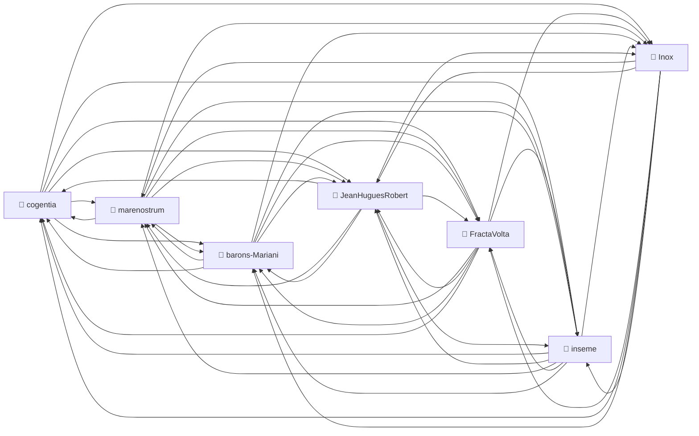

# Corpus Status — JeanHuguesRobert

*Auto-refreshed by `cogentia.js corpus-status`. The structural sections* —
*Registered Repositories, Cross-Reference Graph, Published, What Remains Possible* —
*are regenerated from the registry and from `research/index.md` on every run.*
*The substantive sections* — *What Is Proved* *and* *Open Objections* —
*are manually curated and preserved across refreshes.*

---

## Registered Repositories

<!-- BEGIN_AUTO: registered_repos -->
| Repository | research/index.md | Branch | Last commit |
|---|---|---|---|
| cogentia | ✅ | main | 2026-06-08 |
| FractaVolta | ✅ | main | 2026-06-08 |
| marenostrum | ✅ | main | 2026-06-08 |
| barons-Mariani | ✅ | main | 2026-06-08 |
| inseme | ✅ | main | 2026-06-08 |
| Inox | ✅ | master | 2026-06-08 |
| JeanHuguesRobert | ✅ | main | 2026-06-08 |
<!-- END_AUTO: registered_repos -->

---

## Cross-Reference Graph

<!-- BEGIN_AUTO: graph -->

<!-- END_AUTO: graph -->

---

## Published in this repo

<!-- BEGIN_AUTO: published -->
| Title | Location | Date |
|---|---|---|
| [Agent Brief — Representing Jean Hugues Noël Robert](agent_brief.md) *(operating brief for personal AI agents — mandate, positions, voice, red lines)* | this repo | 2026-05-28 |
| [C.O.R.S.I.C.A., Institut Mariani et corpus personnel](acorsica-et-corpus.md) *(corpus-level institutional boundary note)* | this repo | 2026-06-03 |
| [Project Context](../CONTEXT.md) *(living collaborator briefing — state, priorities, people, constraints)* | this repo | 2026-05-26 |
| [Possibilism](../POSSIBILISM.md) *(the underlying doctrine)* | this repo | 2026-05-09 |
| [Project Ecosystem](../PROJECTS.md) *(map of projects by function)* | this repo | 2026-05-09 |
| [Timeline](../TIMELINE.md) *(thirty-year arc, 1995 → 2026)* | this repo | 2026-05-09 |
| [Documents — All Tracked Repos](documents.md) *(consolidated index across the registry — auto-generated by `cogentia.js documents`)* | this repo | refreshable |
| [Corpus Status](corpus-status.md) *(living view — auto-refreshed by `cogentia.js corpus-status`)* | this repo | refreshable |
| [Concept Index](concepts.md) *(typed concept registry — mapped by `cogentia.js concepts`)* | this repo | refreshable |
<!-- END_AUTO: published -->

---

## Concept Status

<!-- BEGIN_AUTO: concepts -->
| Concept | Scope | Status | Type |
|---|---|---|---|
| [Cogentia](./concepts.md#cogentia) | Global | Working | abstract concept / agentivity class |
| [Cogentigram](./concepts.md#cogentigram) | Global | Working | representation / map |
<!-- END_AUTO: concepts -->

---

## What Is Proved

*Manually curated: claims demonstrated by the published work in this corpus.*

| Claim | Status | Evidence |
|---|---|---|
| _(add claims here)_ | | |

---

## Open Objections

*Manually curated: objections received publicly, not yet fully resolved.*

| Objection | Source | Status |
|---|---|---|
| _(add objections here)_ | | |

---

## What Remains Possible

<!-- BEGIN_AUTO: possibilities -->
- A generated "who-cites-whom" map of the corpus, derived from the registry.
- A single onboarding trail that walks a newcomer from this node through the six repos in reading order.
<!-- END_AUTO: possibilities -->

---

*Generated with `cogentia.js corpus-status` — [scripts/cogentia.js](https://github.com/JeanHuguesRobert/cogentia/blob/main/scripts/cogentia.js)*
*Challenge via issues. Fork to explore alternatives.*

<!-- BEGIN_AUTO: backlinks -->
### Backlinks

*These documents link to this file:*
- [Project Context — Jean Hugues Noël Robert, baron Mariani](../CONTEXT.md)
- [Possibilism](../POSSIBILISM.md)
- [Project Ecosystem](../PROJECTS.md)
- [Agent Brief — Representing Jean Hugues Noël Robert](agent_brief.md)
- [Concept Index — JeanHuguesRobert](concepts.md)
- [Corpus Status — JeanHuguesRobert](corpus-status.md)
- [Research Index — Jean Hugues Noël Robert (Profile / Entry Point)](index.md)
- [Timeline](../TIMELINE.md)

<!-- END_AUTO: backlinks -->
